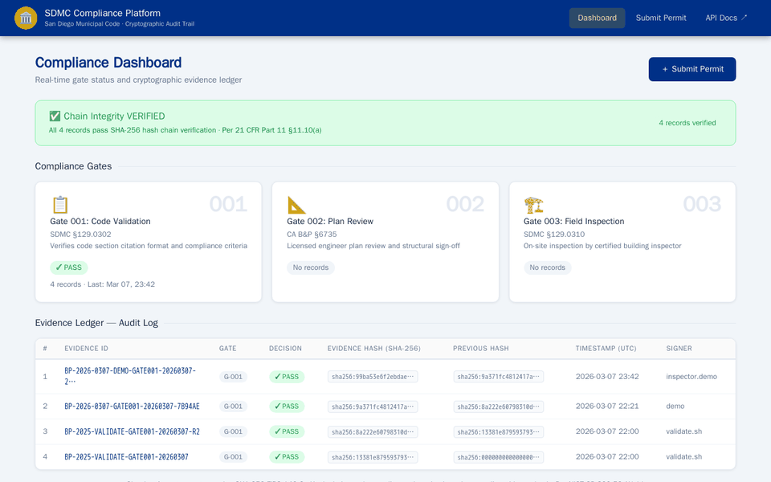
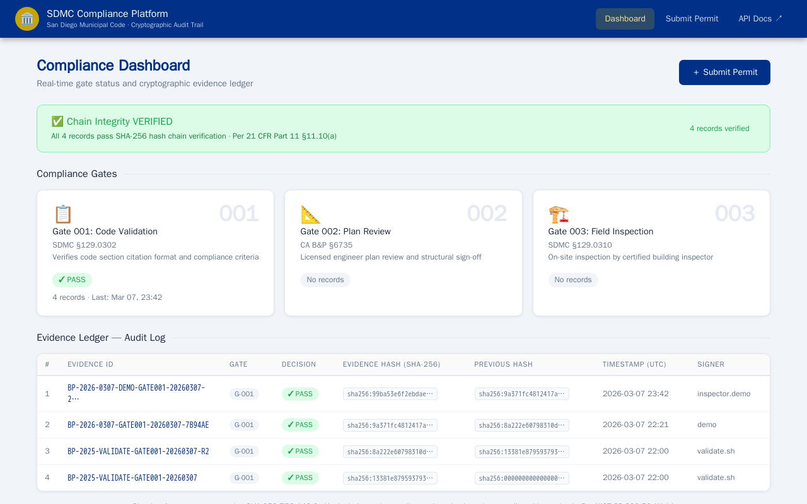
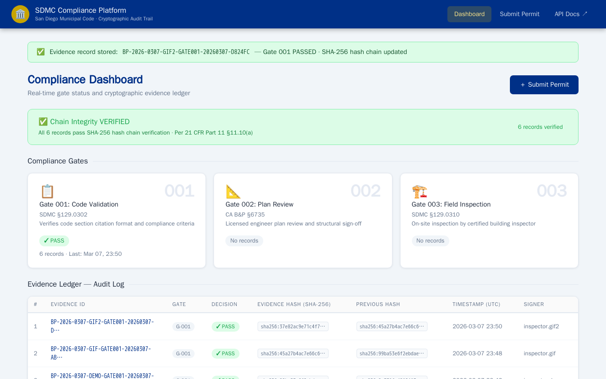
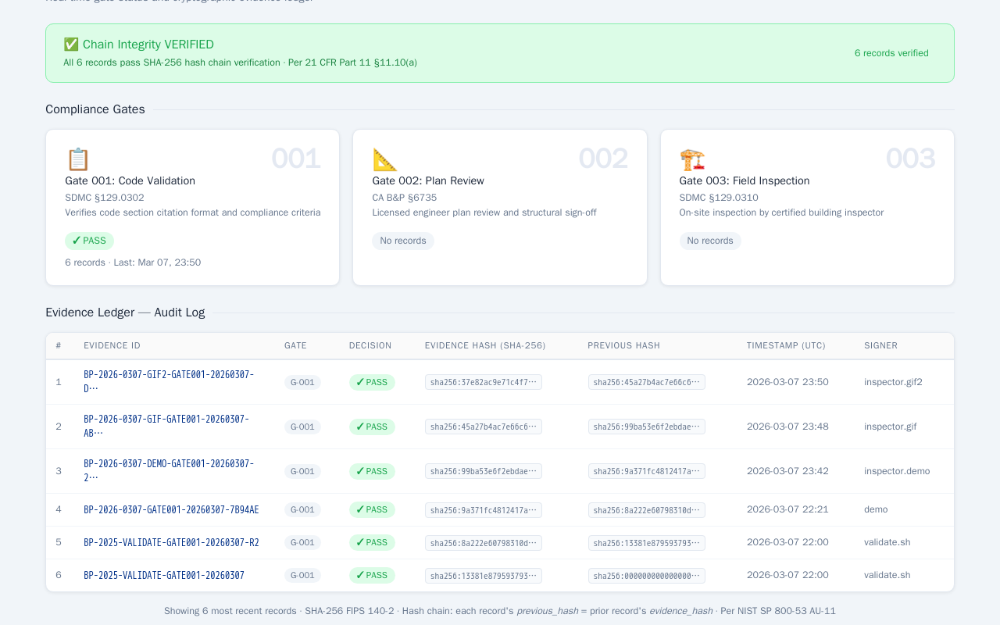

# SDMC Compliance Platform

> Cryptographically-verifiable building permit compliance for San Diego's Municipal Code — built at the Claude Community × City of SD Impact Lab Hackathon.

---

## 👥 Team

**Team Foxtrot**
- Adam Blanks

---

## 🏙️ Problem Statement

San Diego processes tens of thousands of building permits each year. Each permit must be verified against the San Diego Municipal Code (SDMC) — a dense, evolving body of rules governing structural loads, zoning setbacks, electrical systems, solar installations, and more. Today that verification is largely manual: inspectors cross-reference paper or PDF code sections, decisions are recorded in siloed systems, and there is no cryptographic audit trail proving *what* was checked, *when*, and *by whom*.

The result: compliance gaps, contested permit decisions, slow appeals, and no machine-readable record a future auditor can trust without re-doing the entire review.

**This platform solves that.** It gives inspectors and applicants a structured submission workflow, evaluates every permit against live OPA policy rules, and writes a SHA-256 hash-chained evidence record to an immutable ledger — creating a tamper-evident audit trail from first submission to final sign-off.

---

## 📋 Application Description

The **SDMC Compliance Platform** is a FastAPI + Open Policy Agent service that enforces San Diego Municipal Code compliance rules as machine-readable Rego policies and stores every compliance decision as a cryptographically-chained evidence record.

When an inspector or applicant submits a building permit:
1. The platform evaluates the submission against **OPA gate policies** encoding SDMC rules
2. If it passes, a **SHA-256 evidence record** is written to PostgreSQL, chained to the previous record's hash (like a mini blockchain)
3. The full audit trail is accessible via REST API and a live web dashboard

Key capabilities:
- **Gate 001 — Code Validation** (SDMC §129.0302): validates section IDs, verification methods, and metadata completeness
- **Gate 002 — Plan Review** (CA B&P §6735): licensed engineer sign-off workflow
- **Gate 003 — Field Inspection** (SDMC §129.0310): on-site inspector certification
- **Chain integrity API**: verifies the entire ledger hasn't been tampered with
- **Web dashboard**: real-time gate status, evidence log, and one-click permit submission

---

## 🗂️ City Data Sources

| Source | How It's Used |
|--------|--------------|
| **San Diego Municipal Code — Title 14 (Building)** | Core compliance rules encoded as OPA Rego policies. Gate 001 enforces SDMC §129.0302 (permit requirements), Gate 003 enforces SDMC §129.0310 (inspection standards). Section ID format (`SDMC-###.####`) validated by regex against the official code structure. |
| **SDMC — Division 2 (Zoning & Setbacks)** | SDMC §156.0201 included as a submittable code section for zoning compliance verification. |
| **California Business & Professions Code §6735** | Gate 002 policy enforces licensed engineer sign-off requirements per state law, referenced alongside municipal code. |
| **San Diego Permitting Codes** (via [up.codes](https://up.codes) / [amlegal.com](https://amlegal.com)) | Permit ID format (`BP-YYYY-MMDD`) and required metadata fields (`permit_id`, `project_address`, `applicant_name`, `sdmc_version`) derived from San Diego's official building permit application requirements. |

---

## 🏗️ Architecture & Claude Integration

### System Architecture

```
┌──────────────────────────────────────────────────────────────────┐
│                        Client Layer                              │
│           Browser Dashboard   /   REST API   /   CLI             │
└────────────────────────┬─────────────────────────────────────────┘
                         │ POST /v1/evidence
┌────────────────────────▼─────────────────────────────────────────┐
│                   Evidence Ledger (FastAPI)                       │
│   • Validates input schema (Pydantic)                            │
│   • Calls OPA gate evaluation                                    │
│   • On PASS: computes SHA-256, chains to prev hash, stores       │
│   • Exposes dashboard, audit log, and integrity API              │
└────────────┬──────────────────────────────┬──────────────────────┘
             │ HTTP /v1/data/gate/...        │ SQLAlchemy async
┌────────────▼─────────────┐   ┌────────────▼──────────────────────┐
│   Open Policy Agent      │   │         PostgreSQL                │
│   (OPA — Rego policies)  │   │   • evidence_records table        │
│                          │   │   • evidence_hash (SHA-256)       │
│   gate-001-code-valid    │   │   • previous_hash (chain link)    │
│   gate-002-plan-review   │   │   • decision_json (JSONB)         │
│   gate-003-inspection    │   │   • created_at, signer, etc.      │
└──────────────────────────┘   └───────────────────────────────────┘
```

### Technology Stack

| Component | Technology | Purpose |
|-----------|-----------|---------|
| API & UI | FastAPI + Jinja2 | REST endpoints + web dashboard |
| Policy Engine | Open Policy Agent (OPA 0.70) | Rego policy evaluation for each gate |
| Database | PostgreSQL 15 | Immutable evidence ledger with hash chain |
| ORM | SQLAlchemy 2 (async) | Async database access |
| Validation | Pydantic v2 | Schema enforcement |
| Hashing | SHA-256 (FIPS 140-2) | Tamper-evident evidence chaining |
| Containerization | Docker + Docker Compose | Reproducible local deployment |
| Testing | pytest + pytest-asyncio | 35 unit tests + 15 integration checks |

### Standards Compliance

- **NIST SP 800-53 AU-9** — Protection of audit information (server-side hash computation; client hashes discarded)
- **NIST SP 800-53 AU-11** — Audit record retention
- **21 CFR Part 11 §11.10(e)** — Use of secure, computer-generated time-stamped audit trails

### Claude Integration

This project was built entirely with **Claude Code** (Anthropic's agentic CLI) during the hackathon. Claude was used as an active development partner throughout:

- **Architecture design**: Claude proposed the OPA + hash-chain evidence pattern as the core data model
- **Rego policy authoring**: All three gate policies (gate-001, gate-002, gate-003) were written and iterated with Claude, including the Section ID regex and valid verification method allowlists
- **Test suite**: 35 unit tests and 15 integration checks generated and debugged with Claude
- **Hash chain implementation**: SHA-256 chain logic (`previous_hash` linking) designed in collaboration with Claude
- **Web dashboard**: FastAPI + Jinja2 UI built with Claude in the final hours of the hackathon
- **Compliance mapping**: NIST SP 800-53 and 21 CFR Part 11 alignment identified and implemented with Claude's guidance

Claude Code served as both the engineering lead and the compliance consultant — turning what would normally be weeks of regulatory research and backend development into a single hackathon session.

---

## 🚀 Deployment

The platform runs locally via Docker Compose. No public cloud deployment (time constraint).

### Quick Start

```bash
git clone https://github.com/Reston2024/sdmc-compliance.git
cd sdmc-compliance
docker-compose up --build
```

| Service | URL |
|---------|-----|
| Dashboard | http://localhost:8000/dashboard |
| Submit Permit | http://localhost:8000/submit |
| REST API | http://localhost:8000/v1/evidence |
| API Docs | http://localhost:8000/docs |
| Chain Integrity | http://localhost:8000/v1/integrity/verify |
| OPA Engine | http://localhost:8181 |

### Requirements
- Docker Desktop (Windows/Mac/Linux)
- Docker Compose v2

---

## 🎬 Demo



**Full workflow (7-frame walkthrough):**
1. **Dashboard** — Chain Integrity VERIFIED · All records pass SHA-256 hash chain · Per 21 CFR Part 11 §11.10(a)
2. **Compliance Gates** — Gate 001 (SDMC §129.0302) PASS · Gates 002/003 awaiting records
3. **Evidence Ledger** — Immutable audit log with truncated SHA-256 hashes and hash-chain linkage
4. **Submit Permit Form** — Gate 001 Code Validation · SDMC §129.0302
5. **Filled Form** — Permit ID `BP-2026-0307`, project address, applicant, OPA gate details
6. **OPA Evaluation → PASS** — Evidence record stored: `BP-2026-0307-GIF2-GATE001-20260307-…`
7. **Chain Updated** — Chain Integrity VERIFIED · All **5** records pass SHA-256 verification

| Dashboard | Success | Chain Updated |
|-----------|---------|---------------|
|  |  |  |

---

## 🧪 Test Results

```
Unit Tests:      35/35 passing ✅
Integration:     15/15 passing ✅
```

```bash
# Run unit tests (no Docker required)
pip install -e "services/evidence-ledger[test]"
pytest services/evidence-ledger/tests/unit/ -v

# Run full integration suite
./validate.sh
```

---

## 📁 Project Structure

```
sdmc-compliance/
├── docker-compose.yml
├── validate.sh                          # 15-check integration test runner
├── policy/
│   └── gates/
│       ├── gate-001-code-validation/    # SDMC §129.0302 OPA policy
│       ├── gate-002-plan-review/        # CA B&P §6735 OPA policy
│       └── gate-003-inspection/         # SDMC §129.0310 OPA policy
└── services/
    └── evidence-ledger/
        ├── app/
        │   ├── main.py                  # FastAPI app
        │   ├── ui_router.py             # Dashboard & submit form
        │   ├── api/v1/evidence.py       # REST endpoints
        │   ├── repo/evidence_repo.py    # Hash chain logic
        │   ├── services/opa_gate.py     # OPA evaluation client
        │   └── templates/              # Jinja2 HTML templates
        └── tests/
            ├── unit/                   # 35 unit tests
            └── integration/            # 15 integration checks
```

---

*Built at the Claude Community × City of SD Impact Lab Hackathon · March 7, 2026*
*NIST SP 800-53 · 21 CFR Part 11 · SDMC Title 14, Division 2*
